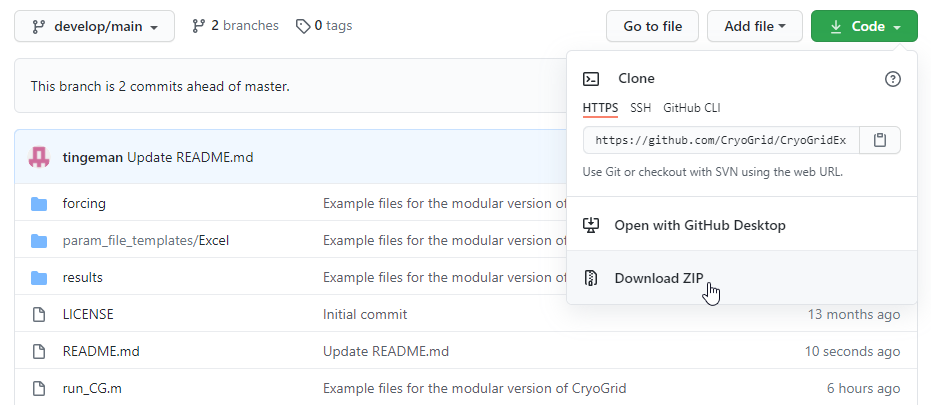

# CryoGridExamples

Download the CryoGrid example code, parameter files and forcing files. Click the green `code` button and choose `Download Zip`. See screenshot below.
(In the upper left hand corner, make sure the `develop/main` branch is selected).



Unzip the the contents to your preferred folder, f.ex. `c:\my_matlab_code\cryogrid\`.
You will now have the following folder structure: `c:\my_matlab_code\cryogrid\CryoGridExamples-develop-main`.
Rename this folder `CryoGridExamples`:

```
rename c:\my_matlab_code\cryogrid\CryoGridExamples-develop-main c:\my_matlab_code\cryogrid\CryoGridExamples
```

Then get the main CryoGrid code  from the separate github repository [CryoGrid/CryoGrid](https://github.com/CryoGrid/CryoGrid/tree/develop/main). Make sure to retrive the `develop/main` branch. Follow download instructions given in the CryoGrid repository to download the code and run the test model.

### Using git

Alternatively, you can obtain the code using git. To run example model:

1. Clone the CryoGridExamples repository to a new directory (fx `c:\my_matlab_code\cryogrid`): 

```
git clone --single-branch --branch develop/main https://github.com/CryoGrid/CryoGridExamples.git
```

2. Navigate into the new directory `c:\my_matlab_code\cryogrid\CryoGridExamples`

```
cd c:\my_matlab_code\cryogrid\CryoGridExamples
```

3. Clone the main CryoGrid model code

```
git clone --single-branch --branch develop/main https://github.com/CryoGrid/CryoGrid.git
```

Start MatLab, navigate to ```c:\my_matlab_code\cryogrid\CryoGridExamples```, and run `run_CG`.
See main CryoGrid repository ([CryoGrid/CryoGrid](https://github.com/CryoGrid/CryoGrid/tree/develop/main)) for furhter instructions.
